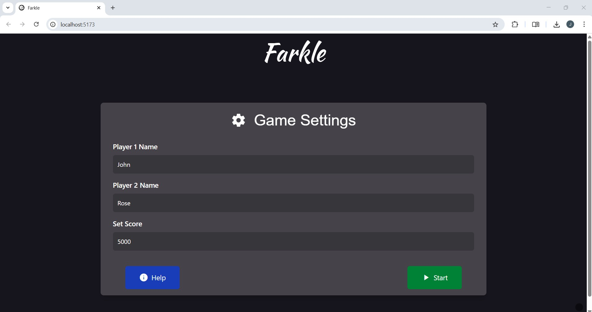
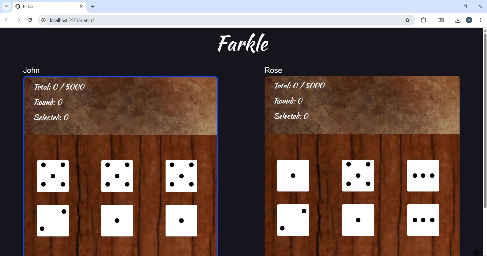
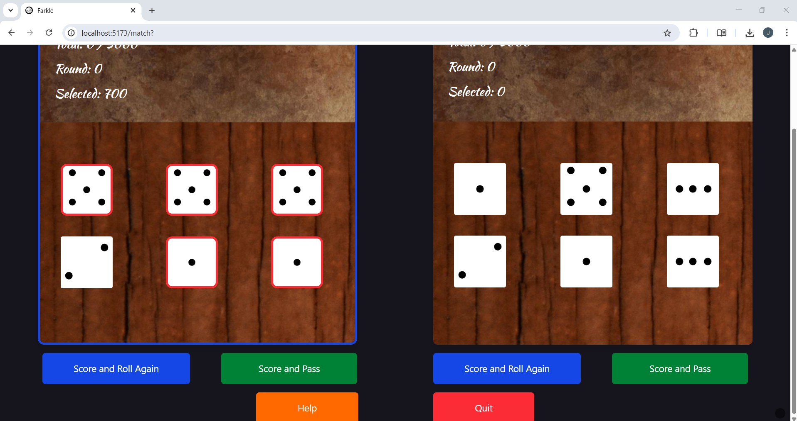
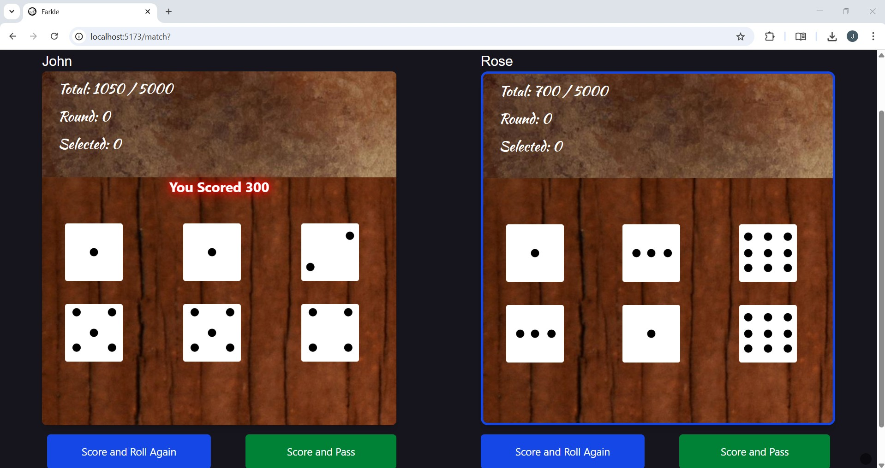
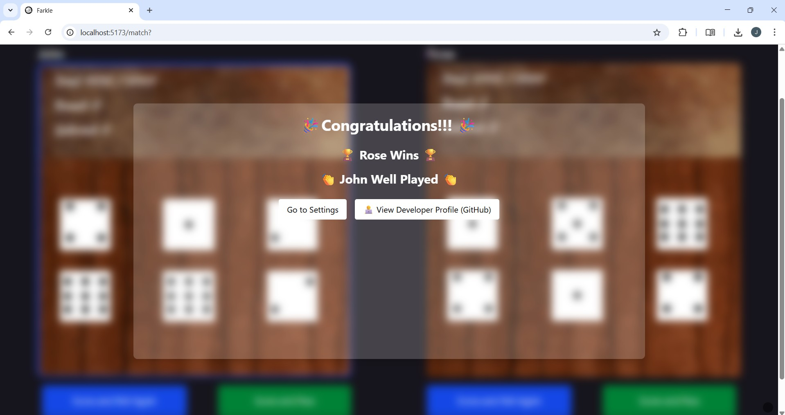

# 🎲 Farkle - A Dice Game
Farkle is a fast-paced dice game where players roll six dice to score points through combinations, risking losing their turn’s score if they roll without scoring.
## 🚀 Features
- 🎮 Two-player mode
- 🎲 Dice roll animation
- 🏆 Score tracking 
## 📌 Game Rules
- Each turn, a player rolls 6 dice.
- Dice that form scoring combinations can be kept, and the player can either roll the remaining dice or bank the score.
- If none of the dice score in a roll, it's a Farkle, and the turn ends with no points.
- If all 6 dice score in one turn, the player can roll all dice again.
- First player to reach score wins!
## 🔢 Scoring


## 📸 Screenshots
### ⚙️ Settings Page


### ❓ Help Page


### 🎮 Game Page 




### 🏆 Winners Page 


## 🧰 Tech Stack

### ⚙️ Frontend
- **React.js** – UI library for building interactive components
- **Vite** – Lightning-fast development server and bundler
- **Tailwind CSS** – Utility-first CSS framework for fast styling

### 🎲 Game Logic
- Custom turn-based game engine using React state
- Dice animation with `setInterval` and React hooks
- Scoring system and rule enforcement based on Farkle mechanics

### 📦 Tooling
- **npm** – Package manager
- **Git** – Version control
- **Google Fonts** – Custom fonts for polished UI

### 🌐 Deployment
- Deployed via **GitHub Pages**

## 🚀 Run Locally

### 1️⃣ Clone the repository

```bash
git clone https://github.com/your-username/your-repo-name.git
cd your-repo-name
```
### 2️⃣ Install dependencies
During installation choose vite-project -> React -> JavaScript <br>
For more details about tailwindCSS please refer [tailwindCSS](https://tailwindcss.com/docs/installation/using-vite)
```bash
npm create vite@latest
cd vite-project
npm install
npm i react-router-dom
npm install tailwindcss
```
### 3️⃣ Start the development server
```bash
npm run dev
```
