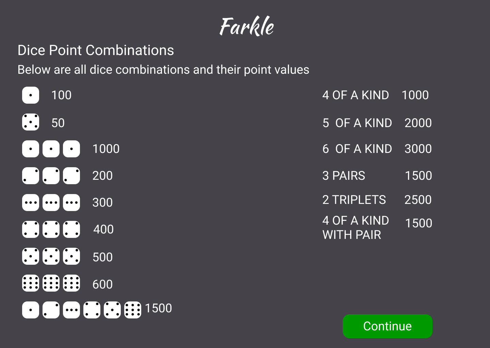

# Farkle
Farkle is a fast-paced dice game where players roll six dice to score points through combinations, risking losing their turn’s score if they roll without scoring.
## Game Rules

<em>Image courtesy of <a href="https://rnkgaming.com/">RNK Gaming</a></em>

